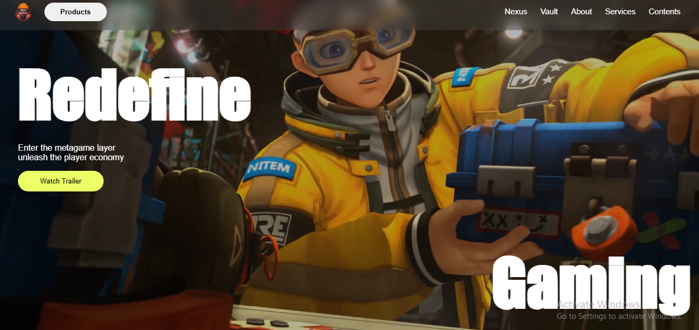

#  Zentry Website Clone Landing Page

This project is a **fully responsive front-end clone** of the official [Zentry website](https://zentry.com), built to replicate its clean layout, modern design, and professional aesthetic using only **HTML, CSS, and JavaScript**.

It was created as a learning project to improve my front-end development skills and practice real-world UI replication.

---

## 🎯 Features

- Pixel-perfect layout closely resembling the original Zentry site
- Responsive design that adapts to desktop, tablet, and mobile screens
- Clean sections for header, hero banner, solutions, contact, and footer
- Smooth scrolling and structured content flow
- Professional fonts, colors, and spacing

---

## 🛠️ Tech Stack

- **HTML5**  
- **CSS3** (Flexbox, Media Queries, Animations)  
- **JavaScript**

---

## 💡 What I Learned

- Translating professional design into functional code
- Structuring a multi-section layout with semantic HTML
- Advanced CSS for responsive layouts and design precision
- Understanding how real-world websites are built and styled

